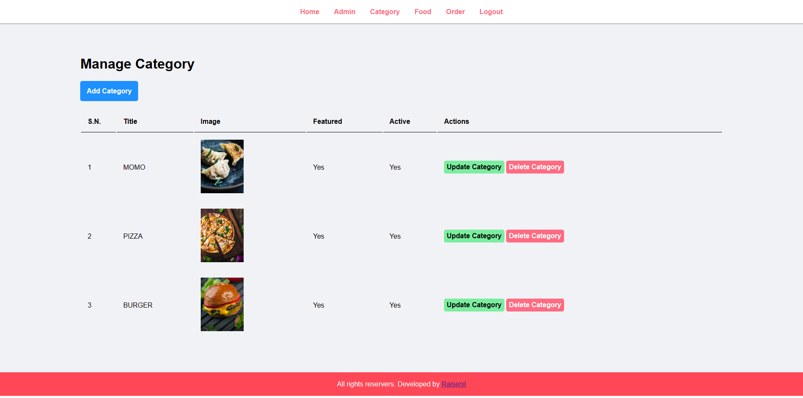
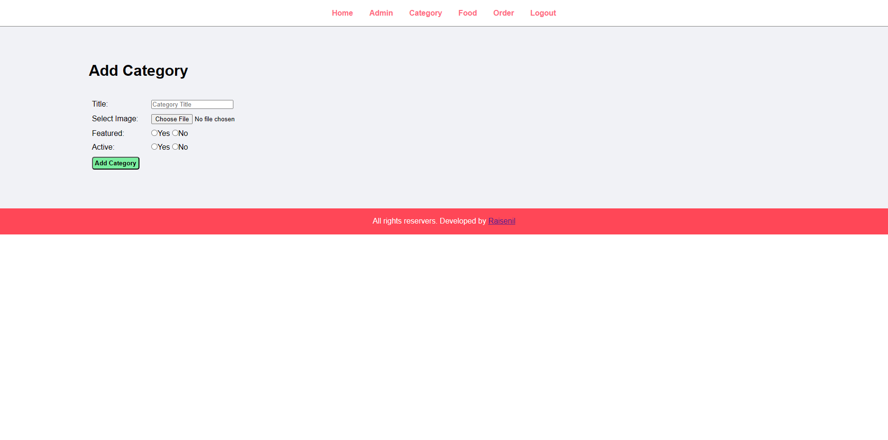
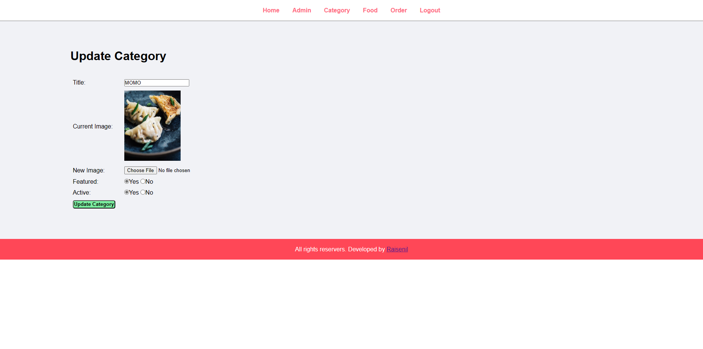
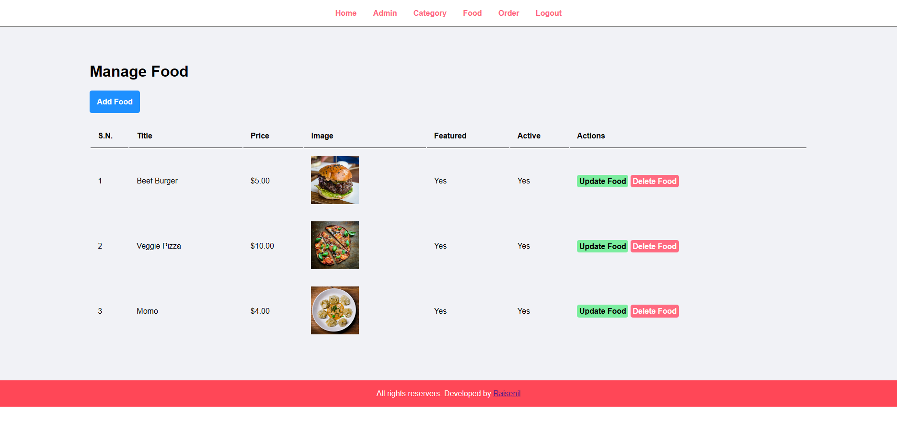
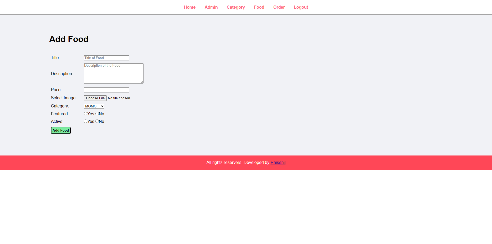
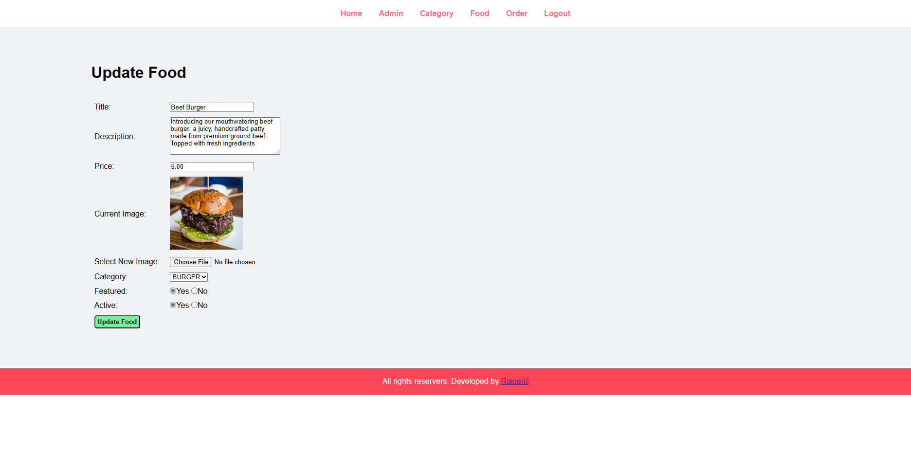

# Food_Order_Website

Welcome to the Food Ordering Website Project where it serves as an online platform for users to conveniently order food from our site. With its user-friendly interface and features,  the website aims to enhance food ordering experience for customers.

## Key Features:

### Main Website
---
> link: http://localhost/Food_Ordering_Website/

#### Home Page

The Home page serves as the main page of the food ordering website. Here Customer can Explore foods. See featured food menu and search their desired food.

<table>
  <tr>
    <td>
      
    </td>
    <td>
      
    </td>
  </tr>
</table>

#### Category Page

The Category page shows the list of food category served by the website.

<table>
  <tr>
    <td>
      
    </td>
    <td>
      
    </td>
  </tr>
</table>

#### Foods Page
This page show the list of Active Foods on the website. And by pressing **Order Now** button Customer can Order their Desired Food.

<table>
  <tr>
    <td>
      
    </td>
    <td>
      
    </td>
  </tr>
</table>

#### Contact Page

This is a simple contact Page where customers can contact with the service owners

### Admin Page
---
> link: http://localhost/Food_Ordering_Website/admin

By the above link user can login to Admin panel. Where user can change Food category, Food menu, Check orders and monitor every section of the Food ordering website.

#### Login Page

Here Admin can `login` with there Username and Password. The login information are stored in **SESSION**.

#### Home Page

`Home page or Dashboard` is the page where user is greeted after login.

Here user can see the quantity of Food categories, Foods, Orders and Total Revenue. 

#### Manage Admin Page

In the `Admin` section from the nav bar user can manage all registered admin users. Here Admin can Remove other users update there information, password and add new Users

By clicking `Add Admin` button New admin can be registered by entering Full Name, Username and Password.

> the password is encrypted using MD5 encryption.

By clicking `Change password` button admin can change there current password with new password.

By clicking `Update Admin` button admin can change there there Full Name and Username.

By clicking `Delete Admin` button admin can delete their desired user from this list.

#### Manage Category Page

In the `Category` section from the nav bar user can manage all Food Category. Here Admin can add New Food Category, Update and Delete. Also admin can manage food categories to be active or featured on the Main Food Ordering Website.

By clicking `Add Category` button New Food category can be added by entering Category Title, category Image and setting Featured and active status.

If Featured status is `YES` the category will be featured in the main page.

If Active status is `YES` the category will be Active in the `Category` (All category) page.

[Note: Only 1st 3 featured category's are showed on the main page. Without the Active status the Category can't be featured ]

By clicking `Update Category` button admin can change the selected categories Title, Image, Featured and active status.

And By clicking `Delete Category` button admin can Delete the selected category.

#### Manage Food Page

In the `Food` section from the nav bar user can manage all Foods. Here Admin can add New Food, Update and Delete. Also admin can manage foods to be active or featured on the Main Food Ordering Website.

By clicking `Add Food` button New Food can be added by entering Food Title, Short description, Price, Image, Category and setting Featured and active status.

If Featured status is `YES` the Food will be featured in the main page.

If Active status is `YES` the Food will be Active in the `Foods` (All Foods) page.

[Note: Without the Active status the Food can't be featured ]

By clicking `Update Food` button admin can change the selected Food Title, Description, Price, Image, Category, Featured and active status.

And By clicking `Delete Food` button admin can Delete the selected Food.

#### Manage Order Page

## Technologies Used:

The Food Ordering website is developed using the following technologies:

- HTML5 and CSS3 for structuring and styling the website.

- Backend technologies like PHP for server-side development.

- Database management system (DBMS) like MySQL for storing and retrieving data.

- Responsive design techniques to ensure optimal display across various devices and screen sizes.

## Other Resources:

### Images collected from 
- [unsplase](https://unsplash.com/)

### Color Pallet
- [flatuicolor](https://flatuicolors.com/)
  - [cn](https://flatuicolors.com/palette/cn)

### Icon Packs
- [icons8](https://icons8.com/)
- [iconic](https://ionic.io/ionicons)

## Installation and Setup:

To set up the Food Ordering website on your local machine, follow these steps:

1\. Clone the repository from GitHub: `git clone https://github.com/Raisenil/Food_Ordering_Website.git`

2\. Download and install XAMPP from the official website `(https://www.apachefriends.org/index.html)`. Follow the installation instructions for your operating system.

3\. Make sure XAMPP is up and running. Start the Apache and MySQL modules from the XAMPP control panel.

4\. Create a New Database by going On the `phpMyAdmin` interface, click on "New" in the left sidebar to create a new database.
Enter name as `food_order` and choose the appropriate collation (usually utf8_general_ci).

5\. Import the Backup by selecting it from the left sidebar. Click on the "Import" tab in the top menu. Click the "Choose File" button to select the .sql backup file from `Database\food_oder.sql`.Choose the default settings or adjust them based on your needs.Click the "Go" button to start the import process.

6\. Update Configuration from `config\constants.php`

5\. Access the website in your browser at `http://localhost:3000`.

## Conclusion:

The Food Ordering website provides an intuitive and efficient platform for users to order food online. With its comprehensive features and user-friendly interface, the website aims to enhance the food ordering experience for customers and streamline restaurant operations.